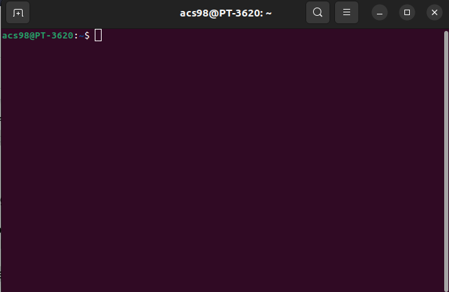
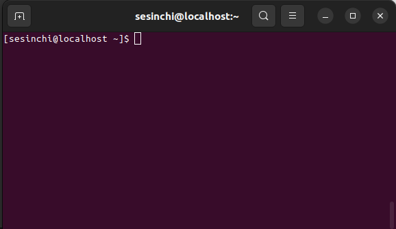
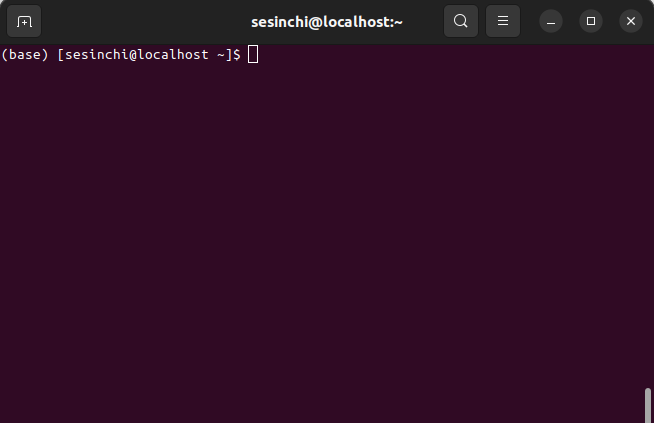
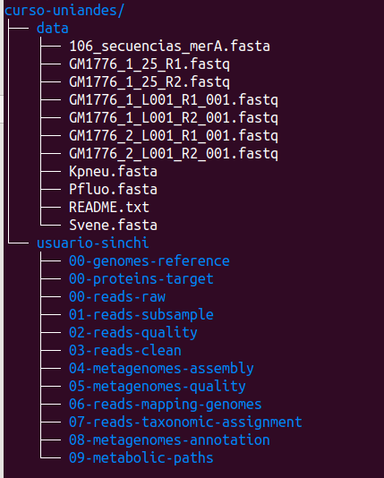

# Introducción a los sistemas operativos tipo UNIX y a los sistemas de cómputo de alto rendimiento (HPC)

El sistema operativo es el conjunto de programas (*software*) que sirve como interfaz entre la máquina (*hardware*) y el usuario, y que le permite a este último ejecutar aplicaciones. Los sistemas operativos más comunes son: Windows, MacOS y Linux. 

MacOS y Linux pertenecen dentro del grupo de sistemas operativos basados en UNIX, un sistema operativo portable, multitarea y multiusuario desarrollado en los Laboratorio Bell de AT&T en 1969. La principal diferencia entre UNIX y Linux es que este último es de código abierto, es decir, cualquier persona puede acceder a su código fuente y modificarlo libremente. Más allá de este detalle (para nada menor) se puede considerar que Linux es un clon de UNIX. Vale la pena resaltar que GNU/Linux fue uno de los principales promotores del movimiento FOSS (Free and Open-Source Software), cuyos ideales ya inclusive se extendieron a otros campos diferentes al desarrollo del software, como por ejemplo, la ciencia. Gracias a esta iniciativa, y en beneficio de la sociedad, el desarrollo de tecnologías informáticas pudo crecer de forma voraz en las ultimas décadas. Tanto es así que más del 80% del internet está montado en plataformas Linux, prácticamente todos los clústers de computación de alto rendimiento (HPC), supercomputadores y Servicios de Cloud (incluyendo Google Cloud, AWS y Microsoft Azure), funcionan usando un sistema operativo basado en Linux. Es más, Linux es el sistema operativo más comúnmente utilizado en el mundo (esto debido a que Android OS es un sistema operativo basado en Linux). Por esta razón, vamos a darle crédito a los dos principales contribuidores a este proyecto: [Richard Stallman](https://en.wikipedia.org/wiki/Richard_Stallman), fundador del [GNU Project](https://www.gnu.org/), y [Linus Torvalds](https://en.wikipedia.org/wiki/Linus_Torvalds), desarrollador de [Linux](https://www.kernel.org/category/about.html).

Desde ahora nos vamos a enfocar únicamente en Linux, sin embargo, tenga en cuenta que en cuanto a arquitectura del sistema, todo aplica de igual forma para todos los sistemas tipo UNIX. Linux está basado en una estructura de directorios jerárquica que toma la forma de un árbol multifurcado como el de la **Figura 1**. Todo el sistema operativo está contenido en el directorio _root (/)_. Dentro del _root_ se encuentran todos los demás directorios del sistema, como _usr_, donde se encuentran todos los ejecutables del sistema, _bin_ que de hecho apunta a los programas más esenciales en la carpeta _usr_, _etc_ que es para archivos de configuración del sistema, _home (~)_, que es donde van a estar los directorios los usuarios del sistema y dentro de estos están todas las demás carpetas de archivos (*Escritorio*, _Documentos_, _Descargas_, etc.), entre otros.


La mayoría de sistemas Linux hoy en día tienen una interfaz gráfica (GUI, por sus siglas en inglés) amigable al usuario desde la cual se pueden llevar a cabo casi todas cualquier de uso cotidiano como crear documentos, imprimir y navegar en internet. No obstante, el corazón de Linux es la línea de comandos que le permite al usuario ejecutar tareas mucho más complejas y poderosas desde una interfaz de linea de comandos (CLI) para interactuar directamente con la máquina utilizando código.

El servidor del Sinchi está montado en un sistema operativo Linux Centos 8 y, como la mayoría de los servidores de este tipo, no cuenta con interfaz gráfica, razón por la cual **debemos** acceder mediante un CLI.

Antes, vamos a introducir algunos conceptos de informática y computación que tenemos que tener en cuenta al hacer uso de computadores para hacer análisis bioinformáticos. Primero, entendamos la estructura básica de un computador cualquiera (**Figura 2**). En primer lugar, por definición, el objetivo de un computador es hacer operaciones, así que siempre va a requerir de una **entrada** (input), que van a ser los datos y las instrucciones a ejecutar (proveídas mediante los dispositivos de entrada físicos como el mouse, teclado, scanner, etc.), y va a entregar una salida (output), que va a ser información procesada (entregada a algún dispositivo de salida como la pantalla, la impresora, la unidad de almacenamiento, etc.).


La unidad de **almacenamiento** es donde se almacena físicamente toda la información del sistema (incluyendo software y archivos). Toda la información que se encuentra en esta unidad no está disponible para ser procesada por el computador en cualquier momento. 

Lo que se conoce como **memoria** (o RAM) es la unidad física donde se almacena temporalmente la información de "trabajo" del computador, es decir todos los datos e instrucciones para que el sistema funcione, y toda la información e instrucciones especificadas por el usuario para ejecutar las tareas que se le está indicando al computador. Este suele ser un componente limitante a la hora de hacer operaciones de cómputo ya que es una unidad con capacidad limitada de almacenamiento.

Por ejemplo, suponga que su computador tiene una capacidad de **almacenamiento** de 1 TB y una capacidad de **memoria** de 16 GB. Usted puede tener un archivo de 500 GB almacenado en su computador, pero si necesita hacer un proceso de cómputo con ese archivo que requiera estar cargado en su totalidad en memoria, e computador no será capaz de ejecutar ese proceso.

El **CPU** (Central processing unit) es el componente físico responsable de realizar las operaciones de computo. Este componente está compuesto por la unidad de control (CU), que se encarga de buscar y organizar la información de la **memoria** y especificar las instrucciones para ejecutar las tareas, y por la unidad aritmética lógica, que es la que se va a encargar de ejecutar todas las operaciones que le indique la CU. Asimismo, las CPUs pueden ser de **core** (o núcleo) **único**, lo que quiere decir que van a ser capaces de ejecutar únicamente una tarea a la vez, o pueden ser de **cores múltiples**, lo que quiere decir que pueden ejecutar tareas en paralelo. Los **cores** son unidades físicas y más que limitar la capacidad de computo, realmente van a acotar la eficiencia en la que se ejecutan procesos.

Por último, un **thread** (o subproceso) es un flujo secuencial de control en un programa que permite realizar múltiples actividades dentro de un mismo proceso. Los procesos de **thread único** se basan en la ejecución de programas (o instrucciones) en una sola secuencia, mientras que los procesos de **thread múltiples** aseguran que un único procesador pueda ejecutar varios subprocesos. Un **thread** es un componente virtual propio de cada proceso, y al igual que usar múltiples cores aumentan la eficiencia de una tarea, utilizar múltiples threads también aumenta la eficiencia de ejecución de un proceso.

Adicionalmente, quizá alguna vez haya escuchado el término **GPU** (Graphics processing unit). Un **GPU**, al igual que un **CPU**, es una unidad que ejecuta operaciones de cómputo, pero que a diferencia de estos componentes, son de diseño especializado para ejecutar tareas específicas, usualmente orientadas a manipular el uso de memoria y paralelizar procesos. Contrario a lo que su nombre sugiere, un **GPU** no necesariamente sirve para procesar imágenes, lo que sucede es que son ampliamente utilizados para esta tarea ya que es un proceso bastante costos computacionalemnte, sin embargo se pueden desarrollar **GPUs** con otros propósitos (inclusive procesos requeridos para análisis bioinformáticos). De todos modos, la mayoría de **GPUs** que vienen en los computadores personales si son diseñados específicamente para el procesamiento de imágenes, así que a pesar de que pueden ser muy útiles para realizar tareas de forma muy eficiente, lo más probable es que no vayamos a ser capaces de hacer uso de ellos para realizar las tareas que queremos ejecutar en bioinformática. El servidor del Sinchi no tiene GPUs, así que no debemos preocuparnos en como usarlas.

En general, cuando se habla de sistemas de computación de alto rendimiento, se habla de sistemas de computo destinados a resolver problemas computacionales avanzados y de altos volúmenes de datos mediante la distribución procesos en unidades de procesamiento en paralelo. La forma más común de acceder a sistemas de estas características es mediante clúster HPC, que básicamente son una colección de computadores (típicamente cada uno de alta capacidad), en este contexto se les conoce como **nodos**, que son administrados y por **nodo** central que se encarga de mediar la interacción entre los usuarios y los recursos computacionales disponibles (**Figura 3**). Un componente central en la administración de recurso de clústers HPC es lo que se conoce como un **manejador de colas**, que es el sistema que se encarga de asignar recursos específicos a tareas especificadas por los usuarios. Uno de los **manejadores de colas** más comunes de encontrar en este tipo de servidores es [Slurm](https://slurm.schedmd.com/overview.html). El servidor del Sinchi realmente no es un clúster HPC, así que no entraremos en detalle de como manejar este sistema, sin embargo se hace la mención de esta herramienta debido a que es probable que en algún momento lleguen a hacer uso de un servidor de este estilo.


El servidor del Sinchi realmente luce más como el de la **Figura 4**, que en últimas, únicamente difiere con el que se representa en la **Figura 3** en que el servidor únicamente consiste en un solo **nodo**. De todas maneras, ¡el servidor con el que cuentan tiene una capacidad decente y por eso en esta guía aprenderemos a sacarle el mayor provecho!


Para que sean conscientes delos recursos con los que cuentan, las características del servidor del Sinchi son las siguientes:

* **Equipo**: SERVIDOR HEWLETT PACKARD
* **Modelo**: HP PROLIANT DL360 GEN10
* **Procesador**: 4208 2.1GHZ 8-CORE 1P 16GB-R P408I-A NC 8SFF 500W PS SERVER
* **Memoria**: 32GB
* **Almacenamiento**: 4 DISCOS DUROS DE 1.92 TB SAS en Raid 2

## Acceso al servidor del Sinchi

Para acceder al servidor se debe establecer una conexión a este mediante la línea de comandos empleando el protocolo `ssh`.

**Credenciales:**

* **host:** 190.26.196.154
* **usuario:** sesinchi
* **puerto:** 2989
* **clave:** S1nch121

### Desde Linux o MacOS X

Para usar la línea de comandos de su computador (en Linux o MacOS X) inicie el programa **Terminal**. Esta aplicación le da acceso a la línea de comandos tipo UNIX a través de un prompt que está en espera de sus instrucciones. El prompt inicial que va a encontrar en la terminal consiste en la cadena de caracteres: *[user@server ~]$* (**Figura 5**), la cual está constituida por el nombre de usuario que está usando la terminal, seguido del nombre de la máquina, el directorio en el que se encuentra actualmente (en este caso el `~` hace referencia al *home*) y el símbolo pesos. Inmediatamente después hay un cursor parpadeante a la espera de sus comandos.



Una vez en el programa Terminal, podrá conectarse al servidor empleando el comando `ssh` como se muestra a continuación.

```{bash eval=FALSE}
ssh -p <port> <user>@<host>
```

Simplemente reemplace _user_ por su usuario, _server_ por el servidor al cual desea conectarse y _port_ por el puerto por el cual tiene acceso al servidor. Así, para conectarnos al servidor del Sinchi el comando que necesitaríamos es:

```{bash eval=FALSE}
ssh -p 2989 sesinchi@190.26.196.154
```

Si es la primera vez que accede a este servidor, se le solicitará que valide el certificado del servidor. Luego de esto se le solicitará la contraseña, ingrésela (los caracteres que escriba no aparecerán en la pantalla). Una vez ingresada la contraseña, será dirigido a la terminal del servidor (**Figura 6**).



### Desde Windows
Si está utilizando alguna versión de Windows existen aplicaciones como SSH Secure Shell Client, PuTTY, Git for Windows, etc., que le permitirán conectarse a cualquier servidor que soporte el protocolo de conexión ssh. Nosotros usaremos [MobaXterm](https://mobaxterm.mobatek.net/download-home-edition.html). Una vez haya instalado el MobaXterm ábralo y busque en la esquina izquierda la opción `Session`. Una vez haya hecho click en `Session` le aparecerá una nueva ventana llamada `Session settings`. En esta ventana seleccione la opción `SSH`. La ventana actual se modificará y será similar a la de la **Figura 7**. En el campo de `Remote host` escriba el servidor al que desea acceder, en `Port` el puerto correspondiente y en `Specify username` escriba el usuario, y Oprima OK.


Luego de esto se le solicitará la contraseña, ingrésela (los caracteres que escriba no aparecerán en la pantalla). Una vez ingresada la contraseña, será dirigido a la terminal del servidor y debería ver algo similar a lo que aparece en la **Figura 6**.

# Manejo de la línea de comandos (¡Hands On!)

**Recomendación:** Tómese el tiempo de explorar el siguiente recurso: [Bash Shortcuts For Maximum Productivity](https://skorks.com/2009/09/bash-shortcuts-for-maximum-productivity/). ¡Posee una gran cantidad shortcuts muy útil para trabajar más eficiente y cómodamente con la línea de comandos!

La forma en que nos comunicamos con nuestro computador utilizando la línea de comandos es mediante un **Shell**. El **Shell** más común (y el que está por defecto en Linux) es Bash, así que es el que aprenderemos a usar. La estructura básica de un comando de Bash es la siguiente:

```{bash eval=FALSE}
comando --flag1 <argumento1> -f2 <argumento2> <argumento3>
```

Tanto `--flag1` como `-f2` especifican argumentos del comando. `argumento3` no corresponde a ningún flag ya que es el argumento principal del comando. Es estándar en la documentación de los programas ver que los argumentos de un comando van entre ‘<>’, esto básicamente indica que es una entrada que puede cambiar dependiendo de lo que el usuario necesite hacer como usuario, más no se deben incluir a la hora de ejecutar el programa como tal.

e.g.

```{bash comment=''}
date -d "next Thursday"
```

En este caso, con el flag `-d` le especificamos al comando date qué tipo de fecha es la que queremos que nos entregue (`"next Thursday"` es el argumento).

Ahora, para obtener información de un comando, puede hacerlo de dos maneras:

i. Llamando el comando con el flag `--help`. e.g.
```{bash comment=''}
whoami --help
```
El que se use `--help` o `-h` (o similar) varía entre programas, pero en general va a ser algo por el estilo.

ii. Llamando el comando `man` con el comando de interés como argumento. e.g.
```{bash comment=''}
man whoami
```

**NOTA:** Antes de empezar, resulta conveniente saber como detener ("matar") la ejecución de un programa. Para hacer esto, sencillamente teclee `Ctrl`+`C`.

## Introducción a Conda para instalar y manejar paquetes bioinformáticos
[Conda](https://docs.conda.io/en/latest/) es un **manejador de paquetes y ambientes** para Python, R, C, y más, que viene con la distribución de [Anaconda](https://www.anaconda.com/). [Conda](https://docs.conda.io/en/latest/) es de acceso abierto y corre en Windows, macOS y Linux. Es un manejador de paquetes, así que facilita la búsqueda e instalación de software y paquetes de programación. Además de instalar el software deseado, [Conda](https://docs.conda.io/en/latest/) también se encarga de instalar las dependencias necesarias para dichos paquetes de tal forma que todos los programas funcionen óptimamente y no se presenten problemas de incompatibilidad entre si. También es un manejador de ambientes virtuales, lo que quiere decir que permite crear espacios en el sistema con software con características (versión, lenguaje, etc.) y de dependencias específicas de tal forma que no interfieran con otros programas del sistema o de otros ambientes virtuales. Estos ambientes resultan muy convenientes ya que en ocasiones necesitamos trabajar con herramientas que no son compatibles entre si, así que sencillamente podemos crear un ambiente para cada herramienta y utilizar dicho ambiente cuando lo veamos conveniente. En el siguiente enlace, encontrará las instrucciones para [instalar Anaconda](https://docs.anaconda.com/anaconda/install/index.html) en su computador. Nosotros ya nos encargamos de instalar [Anaconda](https://www.anaconda.com/) en el servidor del Sinchi, así que podemos proseguir a familiarizarnos con este sistema y explorar las ventajas de utilizarlo.

1. Para activar Conda en su sistema, debe usar el comando:

```{bash eval=FALSE}
conda activate
```

Una vez activado Conda, debería ver que previo al _[user@server ~]$_ en su prompt, debería aparecer un _(base)_ (**Figura 8**):



Note la diferencia con respecto a la **Figura 2**.

2. Como ya mencionamos, con Conda podemos tener ambientes para instalar programas que necesitemos. A pesar de que es probable que en un solo ambiente podríamos instalar todos los programas que necesitamos y no vaya a haber mayor problema, es una buena práctica limitar al máximo la cantidad de software que requerimos instalar por ambiente, y de ser posible, crear un ambiente por herramienta. Nosotros ya creamos algunos ambientes para instalar algunas herramientas de bioinformática útiles. Para revisar los ambientes existentes en el sistema, use el comando:

```{bash eval=FALSE}
conda env list
```
```
# conda environments:
#
base                  *  /home/sesinchi/anaconda3
bbmap                    /home/sesinchi/anaconda3/envs/bbmap
bracken                  /home/sesinchi/anaconda3/envs/bracken
diamond                  /home/sesinchi/anaconda3/envs/diamond
kraken2                  /home/sesinchi/anaconda3/envs/kraken2
krona                    /home/sesinchi/anaconda3/envs/krona
megan6                   /home/sesinchi/anaconda3/envs/megan6
metaphlan4               /home/sesinchi/anaconda3/envs/metaphlan4
qiime2-2019.10           /home/sesinchi/anaconda3/envs/qiime2-2019.10
qiime2-2022.8            /home/sesinchi/anaconda3/envs/qiime2-2022.8
quast                    /home/sesinchi/anaconda3/envs/quast
samtools                 /home/sesinchi/anaconda3/envs/samtools
seqkit                   /home/sesinchi/anaconda3/envs/seqkit
spades                   /home/sesinchi/anaconda3/envs/spades
```

Note que frente al ambiente _base_ hay un asterisco. Esto indica que actualmente nos encontramos en el ambiente _base_ (base). Otra buena práctica es evitar instalar programas directamente en el ambiente base, esto con el fin de evitar conflictos entre programas, algo que es mucho más relevante para este ambiente ya que es el ambiente principal (en otras palabras, lo mejor es dejarlo quieto).

3. Para activar otro ambiente, utilizamos el comando `conda activate <envn>`, donde _envn_ es el ambiente que queremos activar. Activemos el ambiente _seqkit_
```{bash eval=FALSE}
conda activate seqkit
```

Si activó correctamente el ambiente, en lugar de _(base)_ ahora debería ver un _(seqkit)_ antes del _[user@server ~]$_.

4. Para revisar los programas que están instalados en un ambiente, se utiliza:

```{bash eval=FALSE}
conda list
```
```
# packages in environment at /home/sesinchi/anaconda3/envs/seqkit:
#
# Name                    Version                   Build  Channel
seqkit                    2.3.1                h9ee0642_0    bioconda
```

Las siguientes operaciones que vamos a mostrar no las vamos ejecutar, sin embargo quedan como referencia para ustedes para que las utilicen cuando lo necesiten.

5. Para crear un nuevo ambiente, utilizan:

```{bash eval=FALSE}
conda create -n <envn>
```

donde _envn_ es el nombre del ambiente que van a crear (es buena práctica nombrar el ambiente igual a la herramienta que están interesados en instalar posteriormente). Una vez ejecuten el comando anterior les saldrá un mensaje pidiendo confirmar la ubicación de la creación del ambiente: sencillamente acepten la ubicación por defecto. Una vez creen el ambiente, no se le olvide entrar a este utilizando `conda activate`.

6. Ahora vamos a aprender a instalar herramientas con Conda, y es acá donde entenderán una de las principales ventajas de usar este sistema para instalar y utilizar herramientas de bioinformática. Para instalar un paquete, el comando es:

```{bash eval=FALSE}
conda install -c <channel> <package>
```

donde _package_ es la herramienta que desean instalar y _channel_ el **canal** de donde quieren instalar la herramienta. Los **canales** son repositorios remotos donde los paquetes son almacenados. Esto quiere decir que para poder instalar un paquete con Conda, es necesario que el paquete exista en algún canal de Conda. Afortunadamente, existen varios repositorios donde se encuentran una gran gran cantidad de programas que podríamos llegar a necesitar. Por un lado, está el canal propio de [anaconda](https://docs.continuum.io/anaconda-repository/), que es un canal donde Anaconda mantiene y cura los paquetes que se encuentran en este repositorio. Un detalle importante de este repositorio es que los paquetes que contiene son en su gran mayoría para Data Science y Machine Learning (particularmente para Python). También está el canal [conda-forge](https://conda-forge.org/), que es un canal mantenido por la comunidad que posee miles de contribuidores y de paquetes. Este canal posee una cantidad de paquetes mucho más amplia que el resto de canales, además, usualmente los programas están en sus versiones más actualizadas, sin embargo, como es un canal mantenido por la comunidad, no hay garantías de que los paquetes funcionen apropiadamente (pero en general funcionan muy bien). Por último, está el canal [bioconda](https://bioconda.github.io/), que es un canal mantenido por una amplia comunidad de bioinformáticos expertos con el propósito de proveer una muy amplia selección de programas bioinformáticos. La única limitación importante de este canal es que los paquetes de este canal usualmente solamente están hecho para funcionar en sistemas operativos tipo UNIX (macOS y Linux).

De esta manera, para instalar [SeqKit](https://bioinf.shenwei.me/seqkit/) nosotros utilizamos el siguiente comando:
```{bash eval=FALSE}
conda install -c bioconda seqkit
```

para saber si un paquete está disponible en algún canal de Conda, típicamente es suficiente con hacer un búsqueda rápida en Google del estilo "conda instal <paqckage>".

7. Para desactivar un ambiente de Conda (y conda en general) se utiliza el comando:
```{bash eval=FALSE}
conda deactivate
```
y ya no debería aparecer el nombre de ningún ambiente entre paréntesis antes del _[user@server ~]$_ del prompt.

## Comandos básicos de Bash

**Nota:** Puede encontrar una descripción detallada de todos los comandos que vamos a ver a continuación en el siguiente recurso: [Linux Beginner's Shell Cheat page](https://wiki.bits.vib.be/index.php/Linux_Beginner%27s_Shell_Cheat_page)

8. Para visualizar la ruta **absoluta** del directorio actual, se utiliza el comando:
```{bash eval=FALSE}
pwd
```
```
/home/sesinchi
```
Sabemos que es la ruta absoluta para este directorio ya que parte desde el _root_, representado por el `/` al inicio de la ruta, e.i. toda ruta que comience por un `/` es una ruta absoluta.

9. Para conocer la ruta de un programa, utilizamos el comando `which <software>`, entonces, si por ejemplo queremos conocer la ubicación de Python, utilizaríamos:
```{bash eval=FALSE}
which python
```
```
/usr/bin/python
```
10. Si lo que queremos es encontrar la ruta **relacional** de cualquier tipo de elemento, podemos utilizar el comando `find`. Este comando permite hacer búsquedas muy sofisticadas, pero el uso más práctico que le pueden dar es para encontrar archivos, en cuyo caso su uso sería: `find -type f -name <file>`, donde _f_ indica que estamos buscando un archivo y _file_ sería el archivo que queremos encontrar. Por ejemplo, busquemos el archivo *106_secuencias_merA.fasta*:

```{bash eval=FALSE}
find -type f -name 106_secuencias_merA.fasta
```
```
./curso-uniandes/data/106_secuencias_merA.fasta
```

11. Para cambiar de directorio, se utiliza el comando `cd <dir>` donde _dir_ es el directorio al que se desea dirigir. Entonces, para ir al directorio *curso-uniandes*, el comando sería:
```{bash eval=FALSE}
cd curso-uniandes
```

Para verificar que en efecto está en el directorio *curso-uniandes*, podemos correr nuevamente el comando `pwd`.
```{bash eval=FALSE}
pwd
```
```
/home/sesinchi/curso-uniandes
```

Si queremos devolvernos al directorio anterior, podemos usar `cd ..`. `..` siempre señala al directorio inmediatamente anterior al que se está referenciando actualmente. De manera similar `.` señala al directorio actual (en principio, esto no parece muy útil, por ejemplo, si escribimos `cd .` no cambiaríamos de directorio, pero esta referencia es muy útil en otros escenarios que exploraremos más adelante).

12. Para examinar los contenidos del directorio en el que se encuentra actualmente se utiliza el comando:
```{bash eval=FALSE}
ls
```
```
data
```

Si desea examinar los contenidos de un directorio distinto al actual, el comando sería `ls <dir>`. Entonces. si queremos examinar los contenidos del directorio _data_, el comando sería:

```{bash eval=FALSE}
ls data
```
```
106_secuencias_merA.fasta   GM1776_1_L001_R2_001.fastq  Pfluo.fasta
GM1776_1_25_R1.fastq        GM1776_2_L001_R1_001.fastq  README.txt
GM1776_1_25_R2.fastq        GM1776_2_L001_R2_001.fastq  Svene.fasta
GM1776_1_L001_R1_001.fastq  Kpneu.fasta
```

Estos son los datos con los que vamos a trabajar para esta y las demás guías. Si utilizamos el flag `-lh` con el comando `ls` obtenemos información más detallada sobre los archivos (permisos, usuarios, fecha de creación, tamaño, etc.)

```{bash eval=FALSE}
ls -lh data
```
```
total 75G
-rw-r--r-- 1 sesinchi sesinchi 165K nov  4 16:38 106_secuencias_merA.fasta
-rw-r--r-- 1 sesinchi sesinchi  27G nov  8 09:53 GM1776_1_L001_R1_001.fastq
-rw-r--r-- 1 sesinchi sesinchi  27G nov  8 09:54 GM1776_1_L001_R2_001.fastq
-rw-rw-r-- 1 sesinchi sesinchi  11G nov 11 20:36 GM1776_2_L001_R1_001.fastq
-rw-rw-r-- 1 sesinchi sesinchi  11G nov 11 21:16 GM1776_2_L001_R2_001.fastq
-rwxrwxr-x 1 sesinchi sesinchi 4,0K nov 15 19:06 Make-vOTU-RPKM-Norm.pl
-rw-rw-r-- 1 sesinchi sesinchi  721 nov 12 09:06 README.txt
-rw-r--r-- 1 sesinchi sesinchi 5,9M nov  8 11:14 UnicyclerTP30_Hibrido.fasta
```

En esta salida, la cadena de caracteres del principio tiene la siguiente interpretación (**Figura 9**):


Es decir, el primer caracter indica el tipo del archivo (_d_: directorio, _-_: archivo, _l_: enlace), y los demás caracteres indican el tipo de permisos que poseen todos los usuarios del sistema sobre dicho archivo, donde _r_: es de lectura, _w_: es de escritura y _x_: es de ejecución (y `-` significa que no posee ese permiso).

13. Para crear un directorio nuevo utilizamos el comando `mkdir <dir>` (donde _dir_ es el nombre del directorio que queremos crear). Para trabajar el resto de la guía, cree un directorio con su nombre o usuario:

```{bash eval=FALSE}
mkdir usuario-sinchi
```
**Nota:** En lugar de _usuario-sinchi_ escriba su usuario, por ejemplo, en mi caso el directorio se llamaría algo como _a.castellanoss_.

Dentro de su carpeta de trabajo cree los siguientes directorios:

* _00-reads-raw_
* _00-genomes-reference_
* _00-proteins-target_
* _01-reads-subsample_
* _02-reads-quality_
* _03-reads-clean_
* _04-metagenomes-assembly_
* _05-metagenome-quality_
* _06-reads-mapping-genomes_
* _07-reads-taxonomic-assignment_
* _08-metagenomes-annotation_
* _09-metabolic-paths_

```{bash eval=FALSE}
mkdir usuario-sinchi/00-reads-raw
mkdir usuario-sinchi/00-genomes-reference
mkdir usuario-sinchi/00-proteins-target
mkdir usuario-sinchi/01-reads-subsample
mkdir usuario-sinchi/02-reads-quality
mkdir usuario-sinchi/03-reads-clean
mkdir usuario-sinchi/04-metagenomes-assembly
mkdir usuario-sinchi/05-metagenomes-quality
mkdir usuario-sinchi/06-reads-mapping-genomes
mkdir usuario-sinchi/07-reads-taxonomic-assignment
mkdir usuario-sinchi/08-metagenomes-annotation
mkdir usuario-sinchi/09-metabolic-paths
```

Para este punto, dentro de la carpeta _curso uniandes_ debería tener una estructura de archivos similar a la siguiente (**Figura 10**):



En el directorio _data_ hay un archivo llamado _README.txt_ que posee la descripción de los datos y nuestra intención es copiar este archivo en nuestro directorio personal de trabajo.

14. En general, para copiar un archivo o directorio se usa el comando `cp <file1> <file2>` donde _file1_ es el nombre del archivo que desea copiar (incluyendo la ruta) y _file2_ es el nombre del directorio en el que desea copiar el directorio (incluyendo la ruta) y/o el nombre de la copia de _file1_. Entonces, si nos encontramos en el directorio _curso-uniandes_, el comando para copiar el archivo README.txt en nuestros directorios personales sería:
```{bash eval=FALSE}
cp data/README.txt usuario-sinchi
```

Si nos encontráramos en nuestra carpeta personal, también hubiésemos podido usar el comando:

```{bash eval=FALSE}
cp ../data/README.txt .
```

Ambos comandos que se acaban de mostrar utilizan **rutas relacionales** para referencias los archivos y directorios. Son relacionales ya que le damos al comando la ubicación del archivo que queremos copiar y el directorio en el que queremos hacer la copia con respecto al directorio en el que nos encontramos actualmente. Note que si quisiera usar el primero comando y se encontrará en su carpeta personal este no funcionaría ya que dentro de su carpeta personal no hay ningún directorio que se llame _data_, y de igual manera si quisiera usar el segundo comando desde el directorio _curso-uniandes_ no funcionaría ya que al dirigirse una carpeta atrás llegaría al _home_ y ahí no hay ninguna carpeta llamada _data_ que tenga un archivo llamado _README.txt_.

Note que en el segundo comando se utilizaron los caracteres `..` y `.` en la ruta. Esto es útil ya que nos permite referenciar archivos a raíz de nuestro conocimiento de la ubicación de los archivos con respecto a dónde nos encontramos actualmente sin necesidad de saber exactamente el nombre de los directorios.

La alternativa a utilizar rutas relacionales es utilizar **rutas absolutas**. Este concepto ya lo habíamos mencionado al comienzo de la guía, y son básicamente las rutas a los archivos desde el _root_ (que es el directorio principal del sistema que por definición contiene a todos los demás archivos del sistema). Entonces, para realizar la tarea que hicimos realizamos previamente utilizando rutas absolutas, el comando sería:

```{bash eval=FALSE}
cp /home/sesinchi/curso-uniandes/data/README.txt /home/sesinchi/curso-uniandes/usuario-sinchi
```

Note que utilizar rutas absolutas tiene la ventaja de que no importa en qué directorio se encuentre, la ruta va a referenciar apropiadamente los archivos. Por otro lado, se puede volver engorroso escribir las rutas completas.

Una aproximación que se puede considerar híbrida entre usar rutas relacionales y absolutas es mediante el uso del caracter `~` (virgulilla o tilda), que apunta siempre a la carpeta _home_ del usuario. Esta resulta útil ya que muchas veces la estructura de carpetas desde el _root_ puede ser muy amplia y la carpeta a la que se quiere acceder que también distante en relación al directorio actual. Siguiendo con el ejemplo anterior, si hiciéramos uso de esta aproximación, el comando que utilizaríamos sería:
```{bash eval=FALSE}
cp ~/curso-uniandes/data/README.txt ~/curso-uniandes/usuario-sinchi
```

Ahora entre a su carpeta de trabajo.

15. Para visualizar un archivo puede utilizar el comando `cat`:

```{bash eval=FALSE}
cat README.txt
```
```
file                         format  type    num_seqs         sum_len    min_len    avg_len    max_len
106_secuencias_merA.fasta    FASTA   DNA          106         155,889      1,308    1,470.7      1,689
GM1776_1_L001_R1_001.fastq   FASTQ   DNA   80,562,639  12,084,395,850        150        150        150
GM1776_1_L001_R2_001.fastq   FASTQ   DNA   80,562,639  12,084,395,850        150        150        150
GM1776_2_L001_R1_001.fastq   FASTQ   DNA   30,849,054   4,627,358,100        150        150        150
GM1776_2_L001_R2_001.fastq   FASTQ   DNA   30,849,054   4,627,358,100        150        150        150
UnicyclerTP30_Hibrido.fasta  FASTA   DNA            1       5,992,310  5,992,310  5,992,310  5,992,310

```

Como su nombre lo sugiere, en últimas lo que hace `cat` es concatenar los contenidos del archivo (o archivos) que se le dé como entrada, así que si hiciéramos algo como `cat file1 file2 file3` obtendríamos los resultados de los tres archivos concatenados desplegados en pantalla.

16. Si queremos imprimir algo en el prompt, utilizamos el comando `echo`:

```{bash comment=''}
echo "Hello world!"
```

17. Tal y como funciona en otros lenguajes de programación, en Bash se pueden definir variables. En general, existen **variables del sistema**, que son aquellas que utiliza el sistema para su funcionamiento rutinario, y **variables locales** que pueden ser definidas por el usuario. Para llamar una variable, se utiliza el caracter `$` y luego el nombre de la variable. Entonces, para imprimir la variable de sistema _USER_, utilizamos:

```{bash eval=FALSE}
echo $USER
```
```
sesinchi
```

Para definir una variable local, sencillamente hay que utilizar la siguiente sintaxis: `<var>=<value>`, donde _var_ es el nombre de la variable que quiere definir y _value_ el valor que le quiere asignar a la variable. Entonces, para definir una variable llamada _today_ con la fecha del día de hoy utilizaríamos:

```{bash comment=''}
today=$(date -d "today")
echo $today
```

Note que en el comando anterior utilizamos llamamos un comando dentro de `$()`. Esto nos permite hacer justamente eso, tomar la salida de un comando para, en este caso, asignar este resultado a una variable.

18. Aveces es útil sencillamente crear un archivo (vacío), para hacer esta tarea podemos utilizar el comando `touch <file>`, donde _file_ será el nombre del archivo que queremos crear. Cree un archivo que llamado *mi_primer_archivo.txt*:

```{bash eval=FALSE}
touch mi_primer_archivo.txt
```

Verifique el contenido de *mi_primer_archivo.txt*.

19. Podemos asignar el resultado de un programa a un archivo utilizando el operador `>` de la siguiente manera: `<action> > <file>`, donde _action_ es el programa que se va a ejecutar y _file_ el archivo en el que se quiere guardar el resultado del comando. De esta manera, podríamos guardar la fecha de hoy en el archivo que recién creamos de la siguiente manera:

```{bash eval=FALSE}
echo $today > mi_primer_archivo.txt
```

Note que para asignar el resultado de un comando en un archivo, este no tiene que existir previamente, pero si ya existe, los contenidos que posea va a ser sobreescritos por los resultados del comando (verifique el contenido de *mi_primer_archivo.txt*). Si no queremos sobreescribir los contenidos de un archivo pero más bien incluir nuevos resultados en el archivo, podemos utilizar `>>` en lugar de `>`. Siguiendo este orden de ideas, incluya su nombre en *mi_primer_archivo.txt*:

```{bash eval=FALSE}
echo "usuario sinchi" >> mi_primer_archivo.txt
```

Verifique el contenido de *mi_primer_archivo.txt*.

```{bash eval=FALSE}
cat mi_primer_archivo.txt
```
```
sáb nov 12 09:18:25 -05 2022
usuario sinchi
```

20. Para eliminar un archivo, utilizamos el comando `rm <file>`, donde _file_ es el archivo que quiere eliminar. Es importante resaltar que una vez elimine un archivo no hay forma de recuperarlo, así que hay que ser muy cuidadoso con su eso. De esta manera, para eliminar el archivo *mi_primer_archivo.txt*, utilizaríamos:

```{bash eval=FALSE}
rm mi_primer_archivo.txt
```

Si en lugar de un archivo desea eliminar un directorio, debe usar el flag `-rf`, es decir `rm -rf <dir>`.

21. Ahora vamos a crear lo que se conoce como un "soft link" de los datos de entrada en nuestra carpeta personal. La razón por la cual queremos hacer esto es porque queremos tener los datos en nuestra carpeta, sin embargo no vale la pena que los copiemos ya que eso los duplicaría y ocuparía el doble de almacenamiento en el servidor (y estos datos son bien pesados). De esta manera, un "soft link" nos permite crear un enlace, que vamos a poder manipular como si fuera un archivo, a un archivo en otra ubicación del sistema. Para crear un "soft link" de los datos se secuenciación en la carpeta _00-reads-raw_ dentro de nuestro directorio personal, el comando que necesitaríamos sería:

```{bash eval=FALSE}
ln -s /home/sesinchi/curso-uniandes/data/*.fastq /home/sesinchi/curso-uniandes/usuario-sinchi/00-reads-raw
```

Note el uso del `*` en el comando. En general, el `*` se toma como un "comodín", es decir que el sistema lo toma como "cualquier cosa que encuentre"; en el comando anterior, el sistema interpretaría algo como "cualquier cosa que termine en _.fastq_", que son nuestros 4 archivos con lecturas de secuenciación.

De manera similar, creemos una referencia al genoma de referencia en nuestra carpeta _00-genomes-reference_ y una referencia a las proteínas de interés a nuestra carpeta _00-proteins-target_. Para esto podemos utilizar:

```{bash eval=FALSE}
ln -s /home/sesinchi/curso-uniandes/data/*.fasta /home/sesinchi/curso-uniandes/usuario-sinchi
```

para crear una referencia tanto a los genomas de referencia: *Pfluo.fasta*, *Kpneu.fasta* y *Svene.fasta*, como al archivo con las proteínas de interés *106_secuencias_merA.fasta* en nuestra carpeta personal.

22. El comando `mv` nos permite mover archivos o directorios a otras ubicaciones. para mantener nuestro directorio más ordenado, movamos la referencia de los archivos FASTA a sus respectivas carpetas:

```{bash eval=FALSE}
mv ?????.fasta 00-genomes-reference

mv 106_secuencias_merA.fasta 00-proteins-target
```

Note que las sintaxis de este comando es: primero el archivo/directorio que queremos mover, luego la ubicación a donde lo queremos mover. Adicionalmente note que para el nombre de los genomas utilizamos el 'comodin' `?`, que es equivalente al `*` pero solamente para 1 caracter, entonces si usamos 5 `?` seguidos, lo que queremos es cualquier cadena de 5 caracteres que se ajuste al patrón (en este caso, que tenga extensión _.fasta_).

23. En muchas ocasiones vamos a necesitar descargar algún archivo (como datos, códigos, bases de datos, etc.) directamente de la web. Para esto, podemos utilizar el comando `wget`. El uso básico de `wget` es: `wget <url>`, donde _url_ es el URL de archivo que desea descargar. En la Guía 3 haremos uso de 2 scripts del repositorio de GitHub de [KrakenTools](https://github.com/jenniferlu717/KrakenTools), descarguémoslos de una vez:

```{bash eval=FALSE}
wget https://raw.githubusercontent.com/jenniferlu717/KrakenTools/master/combine_kreports.py
wget https://raw.githubusercontent.com/jenniferlu717/KrakenTools/master/kreport2krona.py
```
```
--2022-11-16 16:35:55--  https://raw.githubusercontent.com/jenniferlu717/KrakenTools/master/combine_kreports.py
Resolving raw.githubusercontent.com (raw.githubusercontent.com)... 185.199.111.133, 185.199.108.133, 185.199.109.133, ...
Connecting to raw.githubusercontent.com (raw.githubusercontent.com)|185.199.111.133|:443... connected.
HTTP request sent, awaiting response... 200 OK
Length: 12794 (12K) [text/plain]
Saving to: ‘combine_kreports.py.1’

combine_kreports.py.1                       100%[========================================================================================>]  12,49K  --.-KB/s    in 0,004s  

2022-11-16 16:35:55 (2,86 MB/s) - ‘combine_kreports.py’ saved [12794/12794]

--2022-11-16 16:35:59--  https://raw.githubusercontent.com/jenniferlu717/KrakenTools/master/kreport2krona.py
Resolving raw.githubusercontent.com (raw.githubusercontent.com)... 185.199.108.133, 185.199.109.133, 185.199.110.133, ...
Connecting to raw.githubusercontent.com (raw.githubusercontent.com)|185.199.108.133|:443... connected.
HTTP request sent, awaiting response... 200 OK
Length: 10321 (10K) [text/plain]
Saving to: ‘kreport2krona.py.1’

kreport2krona.py.1                          100%[========================================================================================>]  10,08K  --.-KB/s    in 0,001s  

2022-11-16 16:36:00 (6,76 MB/s) - ‘kreport2krona.py’ saved [10321/10321]
```
Como habrá podido notar, descargamos dos scripts de Python: `combine_kreports.py` y `combine_kreports.py`, muévalos a la carpeta 07-reads-taxonomic-assignment (`mv *.py 07-reads-taxonomic-assignment`).

Ahora, diríjase al directorio _00-genome-reference_. 

24. Para examinar los contenidos de *Pfluo.fasta* podríamos utilizar `cat`, sin embargo, este archivo es muy grande, así que lo que ocurriría es que se demoraría bastante tiempo en desplegar todos los resultados y llenaría por completo nuestro prompt. Una alternativa es utilizar `head`, que desplegará las primeras lineas (por defecto 5) de un archivo:

```{bash eval=FALSE}
head Pfluo.fasta
```
```
>UnicyclerTP30_Hibrido_cor_contig_1 length 5992310 coverage 470.3 normalized_cov 1.00 longread_coverage 41.1 normalized_longread_cov 1.00
ATGTCCCGACTCAATCCCCGGCAGCAAGAAGCCGTGAACTACGTCGGCGGCCCTCTATTG
GTGCTCGCCGGTGCAGGCTCCGGCAAGACCAGCGTGATCACGCGCAAGATCGCGCACTTG
ATCCAGAACTGCGGCATCCGCGCCCAGTACATCGTCGCCATGACCTTCACCAACAAGGCG
GCACGGGAAATGAAAGAGCGGGTCGGCACCCTGCTCAAAGGCGGCGAAGGCCGCGGCCTC
ACCGTGTGCACCTTCCACAACCTGGGCCTGAACATCATCCGCAAGGAGCATGTGCGACTG
GGCTACAAGCCCGGCTTCTCGATCTTCGACGAGACCGACGTCAAGGCCCTGATGACCGAC
ATCATGCAGAAGGAATACGCGGGCGACGACGGCGTAGACGAAATCAAGAACATGATCGGC
TCGTGGAAAAACGACCTGATCCTGCCCGCCGAAGCCCTGGAGGCCGCACGCAACCCCAAG
GAGCAGACCGCCGCCATCGTCTACACCCACTATCAGCGTACGCTCAAGGCGTTCAACGCG
```

25. Otra alternativa es utilizar `less`, que solamente va a abrir el archivo y mostrar su contenido pero solamente lo que alcance a caber en la pantalla, con la opción de deslizar verticalmente para recorrer el contenido del archivo. 

```{bash eval=FALSE}
less Pfluo.fasta
```

`less` se abre como un programa que no permite ejecutar ningún otro comando mientras este esté abierto; para cerrar `less` sencillamente teclee `q`.

## Rutinas útiles en bioinformática desde la línea de comandos

Diríjase a la carpeta *00-proteins-target*.

26. Algo rutinario que se realiza en (bio)informática es buscar elementos en archivos de texto. `grep` ("get repetitions") es una herramienta idónea para esta tarea. La sintaxis básica de este programa es la siguiente: `grep "<pattern>" <file>`, donde _pattern_ es el elemento o patrón que deseo encontrar y _file_ el archivo donde quiero buscarlo. Entonces, si queremos recuperar todos los encabezados de las proteínas en *106_secuencias_merA.fasta*, debido a que es un archivo fasta, sabemos que todos los encabezados van a comenzar por el caracter *>*, así que utilizaríamos:

```{bash eval=FALSE}
grep ">" 106_secuencias_merA.fasta 
```
```
>Acholeplasma_laidlawii_NZ_QRDS01000001.1 merA [organism=Acholeplasma laidlawii] [GeneID=66293769] [chromosome=]
>Achromobacter_ruhlandii_NZ_CADILE010000001.1 merA [organism=Achromobacter ruhlandii] [GeneID=56409823] [chromosome=]
>Acidianus_hospitalis_NC_015518.1 merA [organism=Acidianus hospitalis W1] [GeneID=10601211] [chromosome=]
>Acidianus_hospitalis_NC_015518.1 merA [organism=Acidianus hospitalis W1] [GeneID=10601302] [chromosome=]
>Acidithiobacillus_caldus_NZ_CP026328.2 merA [organism=Acidithiobacillus caldus] [GeneID=65277039] [chromosome=]
>Acidithiobacillus_ferrooxidans_NZ_CP040511.1 merA [organism=Acidithiobacillus ferrooxidans] [GeneID=66433447] [chromosome=]
>Acidithiobacillus_ferrooxidans_NZ_CP040511.1 merA [organism=Acidithiobacillus ferrooxidans] [GeneID=66432020] [chromosome=]
>Acidithiobacillus_thiooxidans_NZ_CP045571.1 merA [organism=Acidithiobacillus thiooxidans ATCC 19377] [GeneID=60696899] [chromosome=]
.
.
.
```
En caso de que solamente quisiéramos conocer el número de veces en que se repite un caracter (en este caso *>* que corresponde al número de proteínas), utilizaríamos el flag `-c` :

```{bash eval=FALSE}
grep -c ">" 106_secuencias_merA.fasta 
```
```
106
```

Ahora aprenderemos a hacer algunas operaciones que suelen ser rutinarias cuando realizamos análisis bioinformáticos. Para esto, vamos a utilizar el programa [SeqKit](https://bioinf.shenwei.me/seqkit/), que es un paquete con varias funcionalidades para hacer procesamiento y analizar archivos FASTA y FASTQ (que sobre decir que típicamente serán las entradas de todos los análisis de genómica y metagenómica). 

Diríjase a la carpeta _00-reads-raw_. Para esta parte es importante que el ambiente _seqkit_ se encuentre activado.

27. Primero, vamos a explorar un poco el comando `seq` de [SeqKit](https://bioinf.shenwei.me/seqkit/) (`seqkit seq -h`). Como se puedo dar cuenta, `seq` nos permite realizar una gran cantidad de operaciones. Por defecto, si solamente `seq` sencillamente va a desplegar el archivo FASTA/Q en un formato apropiado (pero eso lo podemos hacer también con por ejemplo `cat`), pero si por ejemplo queremos obtener el reverso complemento de las secuencias, podemos adicionar al comando `seq` el flag `-pv`. Imprimamos los IDs de las 3 primeras secuencias del archivo *GM1776_1_L001_R1_001.fastq*:

```{bash eval=FALSE}
seqkit seq -pv -t dna GM1776_1_L001_R1_001.fastq | seqkit head -n 3
```
```
@A01045:97:HWNNLDSXX:1:1101:1108:1000 1:N:0:GGCTACAT
TNCGCCCGCTGCAACTCTTATCGGGCCGCCAAGGTAAGTAGGACCAAGTCTATCTCGACCAGCTAGAAAAGGACACGGCGCTATATCCGCCCTATTAGACGGCAGTCGTCCATCATTAGCGGCGGTACCCAATTGGGTAGCTACTAGCCC
+
F#FFFFFFFFFFFFFFFF,F:FFFFFFFFFFFFFFFFFFFFFFFFFFFFFFFFFFFFFFFFFFFFFFF:FFFFF:FFFFFFFFFFFFFFFFF:FFFFFFFFFFFF:FFFFF::FFF:FFFFFFFF,FFF:FFFFFFFFFFF:FFFFFFFF
@A01045:97:HWNNLDSXX:1:1101:1452:1000 1:N:0:GGCTACAT
GNGTGCGAGCCGGACAAACGCGACTTAGTGAAACAGCTCTACGTGCGCGTGGGCAGAGTTGGCCGGAGCATTAGGCCTGCTGAGGAAGGCCCGAAAAAACAACTAAGGCGCTCCGCGTTCGCGCTATCGCGCGTCGTAGTTCTAGCCTTC
+
F#FFFFFFFFFFFFFFFFFFFFFFFFFFFFFFFFFFFFFFFFFFFFFFFFFFFFFFFFFFFFFFFFFFFF:FFFFFFFFFFFFFFFFFFFFFFFF::FFFFFFFFFFFFFFFFFFFFF,FFFFF:::FFFFFFFFFFFFFFFFFFFFF:F
@A01045:97:HWNNLDSXX:1:1101:2609:1000 1:N:0:GGCTACAT
CNACTTCGTGCTGCACCTATGCTTGGCCGTCTAAATACTCCACTACAACGTCGCCCAATTTCTTAGGTCGTAGTGAAGCCGCGACGTTCGGCTTTTATATGCGCACTAACTAGGTCGGTTCCGCGGGGCCGCAGGGGTATGCGGCTTAAG
+
F#FFFFFFFFFFFFFFFFFFFFFFFFFFFFFFFFF:FFFFFFFFF::F,FFFFF:F:FFFF:FFFFFF::FFFFFFFFFFF:FFFFFFFFFFF,FFFF:FFFF,F:FFFFFFFFFFFFFFFFFFFFFFF:FF,FFFFFFFF:FFFFFFFF
```
Note el uso del `|`. Este es el operador "pipe" y lo que hace es dar como entrada al comando que está a la derecha del `|` el resultado del comando que se encuentra a la izquierda. En este caso le pedimos que sacara el reverso complemento de todas las secuencias en *GM1776_1_L001_R1_001.fastq* pero que solamente mostrara las 3 primeras secuencias utilizando el comando `seqkit head`, que a diferencia del `head` del sistema, va a entregar las primeras secuencias en el archivo en lugar de las 3 primeras líneas del archivo (que no van a ser lo mismo ya que una secuencia puede ocupar más de una linea).

28. Para obtener algunas estadísticas simples de nuestras secuencias, podemos utilizar:

```{bash eval=FALSE}
seqkit stats -a *.fastq
```
```
file                        format  type    num_seqs         sum_len  min_len  avg_len  max_len  Q1   Q2  Q3  sum_gap  N50  Q20(%)  Q30(%)  GC(%)
GM1776_1_L001_R1_001.fastq  FASTQ   DNA   80,562,639  12,084,395,850      150      150      150  75  150  75        0  150   98.02   94.57  61.28
GM1776_1_L001_R2_001.fastq  FASTQ   DNA   80,562,639  12,084,395,850      150      150      150  75  150  75        0  150   97.73   93.67  61.47
GM1776_2_L001_R1_001.fastq  FASTQ   DNA   30,849,054   4,627,358,100      150      150      150  75  150  75        0  150   98.04   94.78  59.91
GM1776_2_L001_R2_001.fastq  FASTQ   DNA   30,849,054   4,627,358,100      150      150      150  75  150  75        0  150   97.71   93.95  60.37

```

Ahora vamos a realizar un paso muy importante para el desarrollo del resto de los talleres del curso y es realizar un submuestreo de las secuencias con las que vamos a trabajar. La razón de esto es por practicidad debido a que los archivos son muy grandes y la ejecución de los programas que vamos a correr en las demás secciones sería demasiado demorada. Para esto vamos a utilizar el programa `sample` de [SeqKit](https://bioinf.shenwei.me/seqkit/) pero vamos a aprovechar para aprender a crear y ejecutar scripts. Un script es un archivo de texto plano que contiene código en algún lenguaje de programación y que puede ser ejecutado. Esto resulta muy útil ya que nos permite llevar registro del código que vamos utilizando y reutilizar código que hayamos usado en el pasado. Por convención, los scripts de bash poseen la extensión _.sh_.

Diríjasa a la carpeta *01-reads-subsample*

29. Para modificar un archivo es necesario utilizar un editor de texto. Usualmente los sistemas operativos Linux traen por defecto un par de editores de texto que se pueden utilizar desde la línea de comandos. Entre los editores de este estilo más populares se encuentra `nano`, esto debido a su facilidad de uso. Para modificar un archivo con nano, utilizamos `nano <file>` donde _file_ es el nombre del archivo que deseamos modificar, y si el archivo no existe, nano va a crear un documento vacío con ese nombre. Creemos nuestro primer script de Bash utilizando nano:

```{bash eval=FALSE}
nano subsampling.sh
```

Una vez teclee este comando nano va a abrir el documento en su terminal y va a aparecer un cursos parpadeante que va a indicar en qué parte se va a realizar la modificación. Copie el siguiente pedazo de código en su script (**Tip:** En Linux, para copiar y pegar en la terminal se usa `Ctrl`+`Shift`+`C` y `Ctrl`+`Shift`+`V` respectivamente):

```{bash eval=FALSE}
#!/bin/bash

# 1)
# Fijar el directorio 01-reads-subsample
cd ~/curso-uniandes/usuario-sinchi/01-reads-subsample

# 2)
# Activar conda
source ~/anaconda3/bin/activate
# Activar el ambiente de SeqKit
conda activate seqkit

# 2)
# Hacer un submuestreo de las secuencias
for i in ~/curso-uniandes/usuario-sinchi/00-reads-raw/*.fastq; do
  out=$(basename $i .fastq)
  seqkit sample -p 0.1 $i | seqkit head -n 100000 > $(echo $out)_subsample.fastq
done
```

Una vez acabemos de modificar nuestro archivo oprimimos `Ctrl`+`X`, luego tecleamos `y` para indicar que si queremos guardar las modificaciones relazadas, y finalmente oprimimos `Enter`. **Nota:** En todos los scripts que les pasemos va a ser necesario que ustedes cambien el _usuario-sinchi_ por el nombre de su carpeta personal.

Diseccionemos parte por parte el script. La primera línea indica el tipo de ejecutable que será el script, en este caso, un script de Bash. Además de esa primera linea, todos lo que esté después de un `#` no se va a ejecutar, es decir, será un comentario. Estos típicamente se usan para que el código sea más entendible para los usuarios. En la parte "1)" fijamos el directorio en donde queremos que se ejecuten los comandos que pongamos en el script. La parte "2)" del script está destinada a cargar los módulos (o paquetes) que necesitamos para que nuestro script funcione. 

Finalmente, en la parte "3)" está el código para ejecutar la tarea de hacer un submuestreo para cada archivo de secuencias. Note que en esta sección hacemos uso de un _for_ loop (bucle) para realizar sistemáticamente la tarea de hacer un submuestreo del 10% de las secuencias totales de cada archivo y posteriormente solamente guardar 1000000 secuencias resultantes del submuestreo en un archivo con estructura de nombre similar al original, pero con un *subsample.fastq* al final.

Del _for_ loop del script, lo único que no se a explicado a lo largo de esta guía para poder entenderlo es: por un lado, la estructura de un _for_ loop (que vamos a abordar en un momento), y por otro lado, el comando `basename`. `basename` es un comando que sencillamente entrega el nombre de un archivo sin el "pathname" (ruta) completo y sin en sufijo que se le indique (típicamente se usa para quitar las extensiones de los archivos, como de hecho hacemos en el script). Entonces el uso general de `basename` es: `basename <file> <suffix>`. Ahora, en cuanto al _for_ loop, estos siempre tienen la siguiente estructura:

```{bash eval=FALSE}
for i in <elements>; do
  <body> $i
done
```

donde _elements_ son los elementos sobre los que se quiere iterar la tarea (típicamente nombres de archivos), los elementos deben estra separados por espacios, tabs o cambios de línea. Y _body_ son todos los comandos que ejecutan la tarea deseada y que se quiere que se realice sobe todos los elementos. Note que `$i` tomará el valor del elemento sobre el que se está iterando en cada paso del bucle.

30. Si usa `ls -lh` se dará cuenta que _subsampling.sh_ no tiene permisos de ejecución. Para cambiar los permisos de un archivo utilizamos el comando `chmod`. La sintaxis general de este comando es:

```{bash eval=FALSE}
chmod <+|-><rwx> <file> 
```

donde `+` es para dar permisos y `-` para quitar permisos, _r_ es para permisos de lectura, _w_ es para permisos de escritura y _x_ para permisos de ejecución, y _file_ es el nombre del archivo al que le queremos modificar los permisos. Como en este caso queremos darle permisos de ejecución a nuestro script, utilizaríamos:

```{bash eval=FALSE}
chmod +x subsampling.sh
```

Nuevamente verifique los permisos de *subsampling.sh* con `ls -lh`.

31. Finalmente, para ejecutar nuestro script debemos llamar a Bash (`bash`), para lo que usamos: 
```{bash eval=FALSE}
bash subsampling.sh
```

Una vez corra el script, verifique que se crearon los archivos con los submuestreos de las secuencias utilizando `ls`.

# Determinación de la calidad y limpieza de lecturas de secuenciación

Ahora si vamos a comenzar con el flujo de trabajo bioinformático en un análisis de metagenómica. El primer paso es evaluar la calidad de las lecturas de secuenciación. 

Diríjase al directorio *02-reads-quality*.

32. Como nuestros datos son de Illumina, vamos a utilizar [FastQC](https://www.bioinformatics.babraham.ac.uk/projects/fastqc/). FastQC es muy fácil de utilizar, sencillamente hay que llamar a `fastqc` (que ya está instalado en su servidor) e indicarle el archivo que se quiere analizar.

```{bash eval=FALSE}
fastqc <reads-file>
```

Para determinar la calidad de las secuencias de todos los archivos de lecturas de secuenciación (submuestreaodos) podemos utilizar el siguiente comando:

```{bash eval=FALSE}
fastqc ~/curso-uniandes/usuario-sinchi/01-reads-subsample/*_subsample.fastq -o .
```

FastQC entrega unos reportes de calidad con distintas métricas de las lecturas. Estos resultados se encuentra en los archivos HTML y el las carpetas comprimidas ZIP que genera. Para poder analizar estos datos, es necesarios abrirlos desde un browser con interfaz gráfica, así que es necesario que descargue estos archivos en su computador personal

33. Para descargar archivos desde el servidor del Sinchi a su computador personal, podemos utilizar el protocolo `scp`. La sintaxis de esta herramienta es la siguiente:

```{bash eval=FALSE}
scp -P <port> <user>@<server>:<filepath>/<file> <dir>
```

donde:

* _filepath_: es la ruta del directorio en el servidor donde se encuentra el archivo que desea descargar.
* _file_: es el nombre del archivo que desea descargar.
* _dir_: es la carpeta en su computador donde quiere descargar el archivo.
* _port_, _user_, _server_: son las credenciales del servidor.

Vale la pena resaltar que este comando se utiliza desde la linea de comandos de su computador personal (no la del servidor).

En caso de querer realizar la operación contraria, subir un archivo al servidor desde su computador, sencillamente tiene que invertir el orden de los parámetros en el comando, poniendo de primero la ubicación y nombre del archivo que quiere subir desde su computador y luego la ubicación en el servidor donde quiere cargar el archivo.

```{bash eval=FALSE}
scp -P <port> <filepath>/<file> <user>@<server>:<dir>
```

**Nota:** En ambos casos le va a pedir ingresar la contraseña de usuario del servidor.

Esta misma tarea se puede realizar mediante otros protocolos como [rsync](https://rsync.samba.org/) y [FTP](https://en.wikipedia.org/wiki/File_Transfer_Protocol), en particular, una herramienta muy utilizada para hacer transferencia de archivos entre equipos es 
[FileZilla](https://filezilla-project.org/), que es una herramienta con GUI que utiliza el protocolo FTP para transferir los datos. Acá les dejamos el enlace por si quiere [descargar FileZilla](https://filezilla-project.org/download.php?type=client).

**Nota:** Si está utilizando MobaXterm desde Windows, en el panel de la izquierda salen las opciones para descargar y subir archivos.

Volviendo a los resultados de [FastQC](https://www.bioinformatics.babraham.ac.uk/projects/fastqc/), para descargar los archivos que nos interesan en la carpeta de descargas en su computador personal, el comando que necesitaría sería (asumiendo que su computador está en español y la carpeta de descargas se llama _Descargas_):

```{bash eval=FALSE}
scp -P 2989 sesinchi@190.26.196.154:~/curso-uniandes/usuario-sinchi/01-reads-quality/* ~/Descargas/
```

Abra los resultados y examínelos. En el siguiente vídeo describen parte por parte las secciones que posee un reporte de [FastQC](https://www.bioinformatics.babraham.ac.uk/projects/fastqc/) y como interpretar dichos resultados: https://www.youtube.com/watch?v=bz93ReOv87Y.

En general, encontrara que los datos poseen muy buena calidad. No obstante, vamos a continuar con nuestro flujo de trabajo bioinfromático completo y vamos a realizar la limpieza (o filtrado) de los datos por calidad usando [Trimmomatic](http://www.usadellab.org/cms/?page=trimmomatic)

Diríjase a la carepta *03-reads-clean*

34. En general, en la página principal de [Trimmomatic](http://www.usadellab.org/cms/?page=trimmomatic) está muy bien descrita la sintaxis de cómo correr este programa y qué hace cada parte del comando, así que directamente les vamos a dejar a continuación un script para hacer sistemáticamente la limpieza de los datos con `trimmomatic` (que también ya estaba instalado en su servidor):

```{bash eval=FALSE}
#!/bin/bash

cd ~/curso-uniandes/usuario-sinchi/03-reads-clean/

# Limpieza de secuencias pair end
path=~/curso-uniandes/usuario-sinchi/01-reads-subsample/
out=_clean
p=_paired
u=_unpaired
ext=_001_subsample.fastq
for sample in GM1776_1_L001_R GM1776_2_L001_R; do
  forward=${sample}1
  reverse=${sample}2
  java -jar /bin/sinchi/trimmomatic/trimmomatic-0.39.jar PE $path$forward$ext $path$reverse$ext \
  $forward$out$p$ext $forward$out$u$ext $reverse$out$p$ext $reverse$out$u$ext \
  ILLUMINACLIP:TruSeq3-PE:2:30:10:2 SLIDINGWINDOW:4:15 MINLEN:125
done
```

De por si ya sabíamos que las lecturas eran de muy alta calidad, así que en este caso puede verificar las características de las secuencias resultantes utilizando `fastqc` o `seqkit stats`. 

**Nota:** Debido a que las lecturas eran de muy alta calidad desde el principio y a pesar de que en general no tuvimos que haber perdido muchas lecturas por en el paso de filtrado por calidad, para asegurarnos de trabajar en todos los casos con 100k lecturas en el resto de las guías vamos a seguir trabajando con los datos que únicamente fueron submuestreados. 